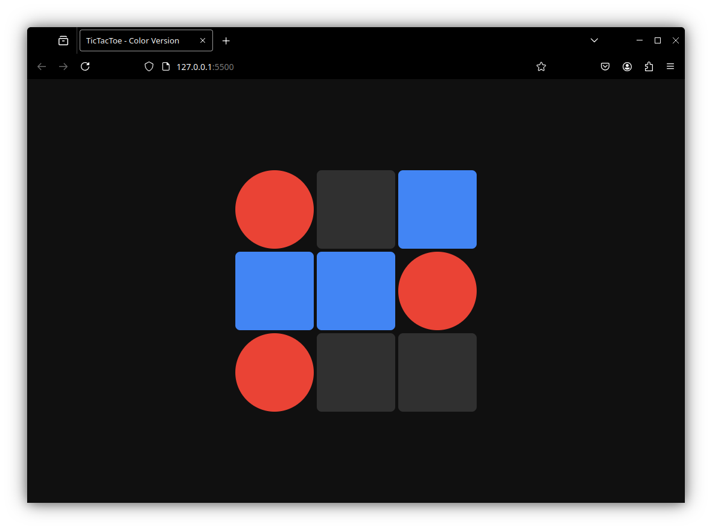

# TicTacToe-AI

An **Unbeatable TicTacToe AI** implemented using the recursive Minimax algorithm with alpha-beta pruning and configurable maximum search depth. This AI plays perfectly on the classic 3x3 TicTacToe board.

I also created a web app so users can play against this AI in real-time!


<a href="https://zaqks.github.io/TicTacToe-AI">You can always attempt to conquer it here, if you dare.</a>

---

## Features

- Unbeatable AI using Minimax with alpha-beta pruning for efficient search
- Configurable search depth to balance performance and intelligence
- Supports both Python and JavaScript implementations
- Modular, clean, and memory-optimized code
- Web app interface for interactive gameplay


# JS Usage Example
```js
const game = new TicTacToeMinimax(5);

const initialGrid = [
  [1, 2, 0],
  [0, 1, 0],
  [1, 0, 0],
];

TicTacToeMinimax.printGrid(initialGrid);
const bestMove = game.findBestMove(initialGrid);
console.log("Best move:", bestMove);
```

# Python Usage Example
```py
if __name__ == "__main__":
    game = TicTacToeMinimax(max_depth=5)

    # Multiple calls with different states:
    state = [
        [2, 1, 0],
        [0, 1, 0],
        [0, 0, 0]
    ]

    game.print_grid(state)
    best_move = game.find_best_move(state)
    print("Best move:", best_move)
```
